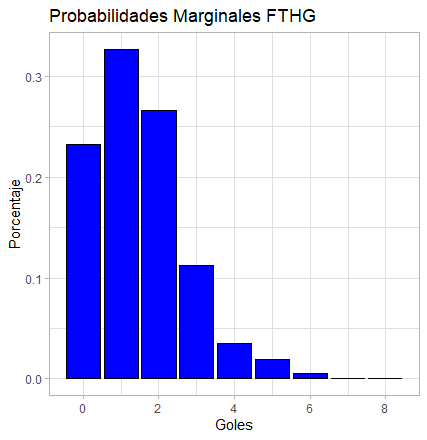
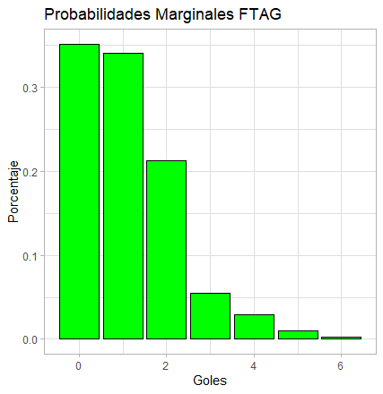

# Postwork 03 Análisis Exploratorio de Datos con R

Cargamos el dataframe obtenido en el [Postwork 02](https://github.com/edsatan/Proyecto-R/tree/main/Postwork-02) y modificamos el formato de las fechas.
 ```R
data <- read.csv("https://raw.githubusercontent.com/edsatan/Proyecto-R/main/Postwork-02/dataPostwork2.csv")

data <- mutate(data, Date = as.Date(Date, "%Y-%m-%d"))
```

Seleccionesmos nuestras columnas de interés (Goles de casa `FTHG` y goles de visitante `FTAG`) para realizar el cálculo de las probabilidades marginales y conjunta como en el [Postwork 01](https://github.com/edsatan/Proyecto-R/tree/main/Postwork-01)

```R
homeGoals2 <- data$FTHG
awayGoals2 <- data$FTAG
```

Calculamos las probabilidades marginales y la conjunta

* Probabilidad marginal equipo de casa

```R
probCasa <- table(homeGoals2)/length(homeGoals2)
probCasa

#homeGoals2
#          0           1           2           3           4           5           6           7           8 
#0.232456140 0.327192982 0.266666667 0.112280702 0.035087719 0.019298246 0.005263158 0.000877193 0.000877193 
```

* Probabilidad marginal equipo visitante

```R
probVisitante <- table(awayGoals2)/length(awayGoals2)
probVisitante

#awayGoals2
#          0           1           2           3           4           5           6 
#0.351754386 0.340350877 0.212280702 0.054385965 0.028947368 0.009649123 0.002631579 
```

* Probabilidad conjunta

```R
probConjunta <- table(homeGoals2, awayGoals2)/length(homeGoals2)
probConjunta

#          awayGoals2
#homeGoals2           0           1           2           3           4           5           6
#         0 0.078070175 0.080701754 0.045614035 0.018421053 0.005263158 0.004385965 0.000000000
#         1 0.115789474 0.114912281 0.068421053 0.017543860 0.008771930 0.001754386 0.000000000
#         2 0.087719298 0.093859649 0.061403509 0.011403509 0.008771930 0.001754386 0.001754386
#         3 0.044736842 0.032456140 0.024561404 0.006140351 0.001754386 0.001754386 0.000877193
#         4 0.014035088 0.010526316 0.007017544 0.000000000 0.003508772 0.000000000 0.000000000
#         5 0.008771930 0.005263158 0.004385965 0.000000000 0.000877193 0.000000000 0.000000000
#         6 0.002631579 0.001754386 0.000000000 0.000877193 0.000000000 0.000000000 0.000000000
#         7 0.000000000 0.000877193 0.000000000 0.000000000 0.000000000 0.000000000 0.000000000
#         8 0.000000000 0.000000000 0.000877193 0.000000000 0.000000000 0.000000000 0.000000000

```

Para entender mejor los resultados de las operaciones realizadas, desplegaremos unos gráficos utilizando la librería `ggplot2`. 

```R
library(ggplot2)
```

Para el caso de las probabilidades marginales, se obtó por utilizar un gráfico de barras, permitiendonos observar la distribución y comportamiento de las distintas probabilidades de una manera más rápida y sencilla.

```R
probCasaPlot <- ggplot() + 
                geom_col(aes(x=0:8, y=probCasa), color="black", fill="blue")+
                ggtitle("Probabilidades Marginales FTHG") +
                ylab("Porcentaje") +
                xlab("Goles") + 
                theme_light()

probCasaPlot
```

<p align="center">
  
</p>

```R
probVisitantePlot <- ggplot() + 
                     geom_col(aes(x=0:6, y=probVisitante), color="black", fill="green")+
                     ggtitle("Probabilidades Marginales FTAG") +
                     ylab("Porcentaje") +
                     xlab("Goles") + 
                     theme_light()
probVisitantePlot
```

<p align="center">
  
</p>

Para la probabilidad conjunta, en donde interactuan dos variables, goles de locales y goles de visitantes, obtamos por un mapa de calor para ilustrar los resultados. Por medio de un mapa de color podemos determinar los disntintos valores de probabilidad obtenidos dependiendo de la tonalidad que adquieran, permitiendo un análisis visual sencillo.

```R
install.packages("reshape2")
library(reshape2)

probConjunta <- melt(probConjunta)

probConjuntaPlot <- ggplot()+
  geom_tile(aes(x=probConjunta$homeGoals2, y=probConjunta$awayGoals2, fill=probConjunta$value))+ 
  labs(x="Goles Local", y="Goles Visitante", fill="Porcentaje")+
  scale_x_continuous(breaks = unique(probConjunta[,1]))+ ##Determinamos los valores unicos para X
  scale_y_continuous(breaks = unique(probConjunta[,2]))+ ##Determinamos los valores unicos para y
  scale_fill_gradient2(high = "green", mid = "black")
probConjuntaPlot
```

<p align="center">
  
</p>


<h3 align="center"> ⏭️ <a href="https://github.com/edsatan/Proyecto-R/tree/main/Postwork-04"> Postwork 04</a></h3>
