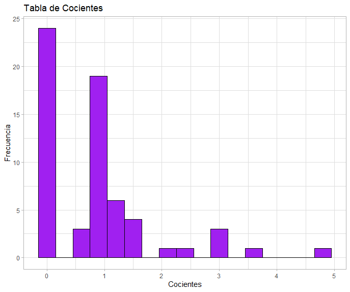

Cargamos el archivo del [postwork 2](https://github.com/edsatan/Proyecto-R/tree/main/Postwork-02) y seleccionamos las columnas de interés

```R
data <- read.csv("dataPostwork2.csv")

homeGoals2 <- data$FTHG
awayGoals2 <- data$FTAG
``` 

Obtenemos una tabla de cocientes al dividir estas probabilidades conjuntas por el producto de las probabilidades marginales correspondientes. Creamos un Dataframe con la probabilidad conjunta 

```R
probdf <- as.data.frame(table(homeGoals2, awayGoals2)/length(homeGoals2))
```

Renombramos la columna de `frecuencia` como `conjunta`

```R
colnames(probdf)[3] <- "Conjunta"
```

Agregamos la probabilidad marginal del equipo de casa

```R
probdf$marginalcasa <- probCasa
```

Hacemos un vector de la probabilidad marginal del equipo visitante que se repita de la forma a la columna awayGoals2

```R
probVisitanteVector <- rep(probVisitante,length(probCasa))
probVisitanteVector<- probVisitanteVector[order(names(probVisitanteVector))]
probdf$marginalvisita <- probVisitanteVector
```

Agregamos la columna del producto de las probabilidades marginales

```R
probdf$prodMarginal <- probdf$marginalcasa*probdf$marginalvisita
```
Y por último agregamos la columna del cociente de la probabilidad conjunta entre el producto de las marginales y mostramos el dataframe final

```R
probdf$cociente <- probdf$Conjunta/probdf$prodMarginal

head(probdf,10)
#   homeGoals2 awayGoals2    Conjunta marginalcasa marginalvisita prodMarginal  cociente
#1           0          0 0.078070175  0.232456140      0.3517544 0.0817674669 0.9547829
#2           1          0 0.115789474  0.327192982      0.3517544 0.1150915666 1.0060639
#3           2          0 0.087719298  0.266666667      0.3517544 0.0938011696 0.9351621
#4           3          0 0.044736842  0.112280702      0.3517544 0.0394952293 1.1327151
#5           4          0 0.014035088  0.035087719      0.3517544 0.0123422592 1.1371571
#6           5          0 0.008771930  0.019298246      0.3517544 0.0067882425 1.2922240
#7           6          0 0.002631579  0.005263158      0.3517544 0.0018513389 1.4214464
#8           7          0 0.000000000  0.000877193      0.3517544 0.0003085565 0.0000000
#9           8          0 0.000000000  0.000877193      0.3517544 0.0003085565 0.0000000
#10          0          1 0.080701754  0.232456140      0.3403509 0.0791166513 1.0200350
```
Grafícamos la tabla de cocientes para conocer la distribución

```R
tablaCocientesPlot <-   ggplot() + 
                        geom_histogram(aes(probdf$cociente), color="black", fill="purple", binwidth = 0.3)+
                        ggtitle("Tabla de Cocientes") +
                        ylab("Frecuencia") +
                        xlab("Cocientes") + 
                        theme_light()

tablaCocientesPlot
```

<p align="center">
  
</p>

Mediante un procedimiento de boostrap, obtnemos más cocientes similares a los obtenidos en la dataframe `probdf`. Aplicamos el remuestreo bootstrap

```R
bootstrap <- replicate(n=10000, sample(probdf$cociente, replace=TRUE))

dim(bootstrap) ##Obtenemos el remuestreo en cada nueva columna
```

Obtenemos las medias de cada uno de los remuestreos

```R
mediasBS <- apply(bootstrap, MARGIN = 2, FUN = mean)
summary(mediasBS)

mediasBSPlot <-   ggplot() + 
  geom_histogram(aes(mediasBS), color="black", fill="purple")+
  ggtitle("Tabla de medias remuestreadas \"BootStrapping") +
  ylab("Frecuencia") +
  xlab("Medias") + 
  theme_light()

mediasBSPlot
```

Menciona en cuáles casos le parece razonable suponer que los cocientes de la tabla en el punto 1, son iguales a 1 (en tal caso tendríamos independencia de las variables aleatorias X y Y).

"""
  - A menor cantidad de goles, existe una mayor independencia
  
"""
