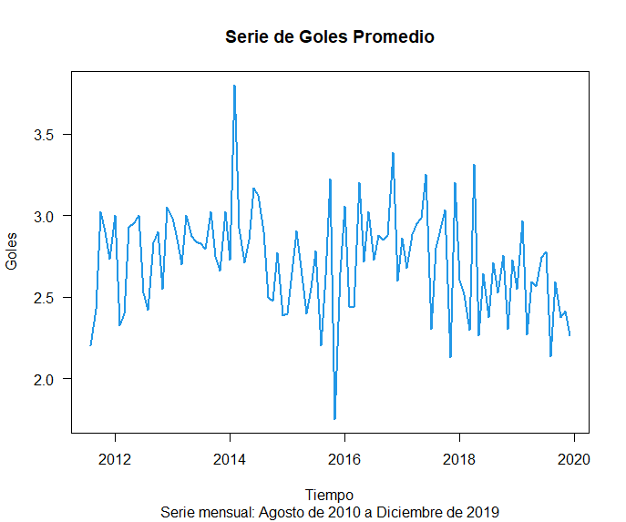

Importa el conjunto de datos match.data.csv a R y realiza lo siguiente:
Agrega una nueva columna sumagoles que contenga la suma de goles por partido.

```R
link = paste("https://raw.githubusercontent.com/beduExpert/Programacion-R-Santander-2021/",
             "main/Sesion-06/Postwork/match.data.csv", sep = "")
match.data <- read.csv(link, header = TRUE)
match.data$sumagoles <- match.data$home.score + match.data$away.score
```

Obtén el promedio por mes de la suma de goles.

```R
library(dplyr)

serie <- match.data %>% mutate(anio_mes = substr(date, 1, 7)) %>%
  group_by(anio_mes) %>% summarize(goles_prom = mean(sumagoles))
```

Crea la serie de tiempo del promedio por mes de la suma de goles hasta diciembre de 2019.
serie.ts <- ts(serie$goles_prom, end = c(2019, 12), frequency = 12)

Grafica la serie de tiempo.

```R
plot(serie.ts, las = 1, col = 4, lwd = 2, xlab = "Tiempo", ylab = "Goles",
     main = "Serie de Goles Promedio",
     sub = "Serie mensual: Agosto de 2010 a Diciembre de 2019")
```
<p align="center">
  
</p>

<h3 align="center"> ⏭️ <a href="https://github.com/edsatan/Proyecto-R/tree/main/Postwork-07"> Postwork 07</a></h3>
